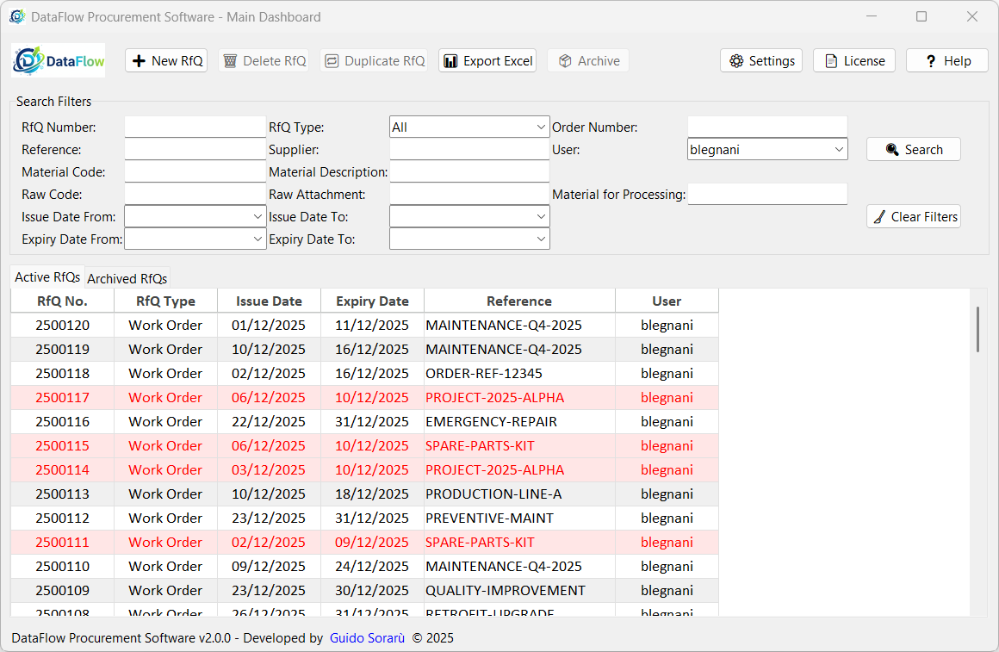
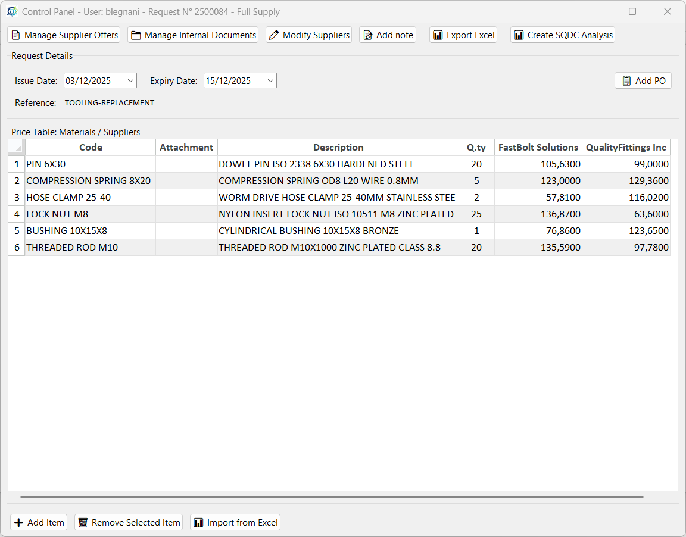
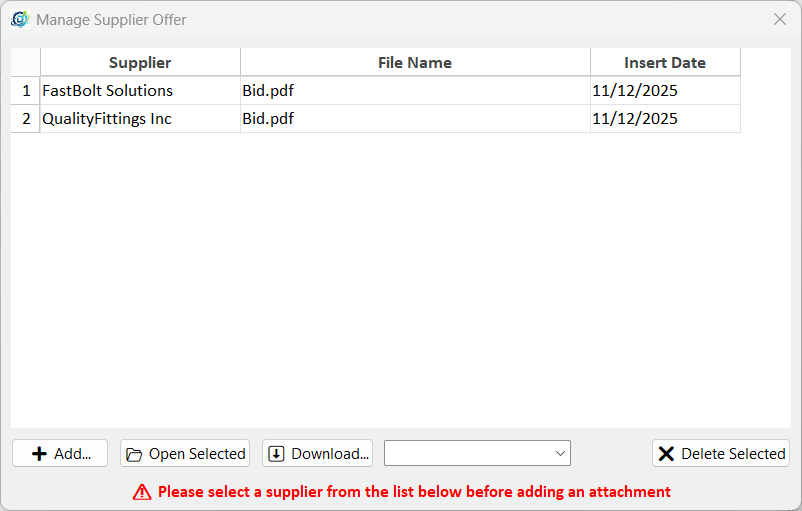
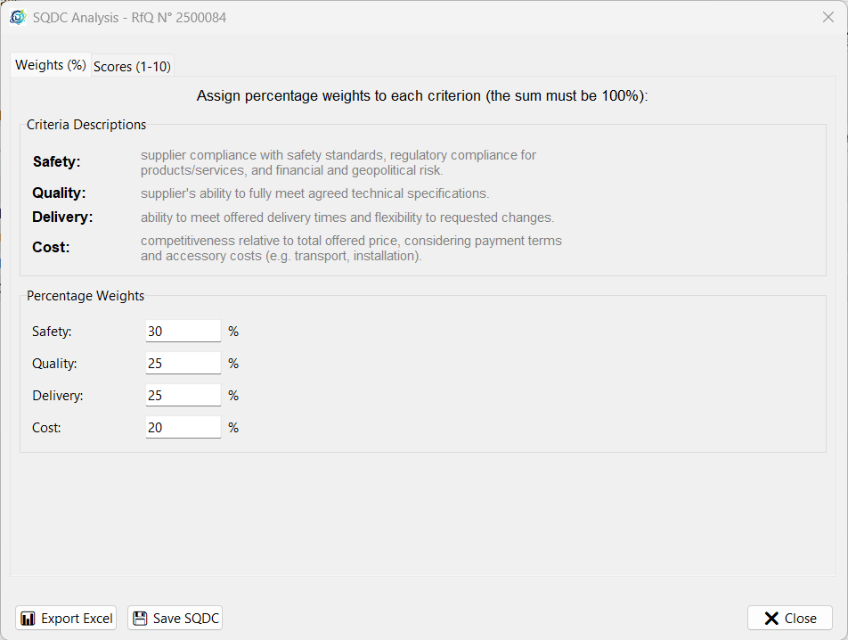
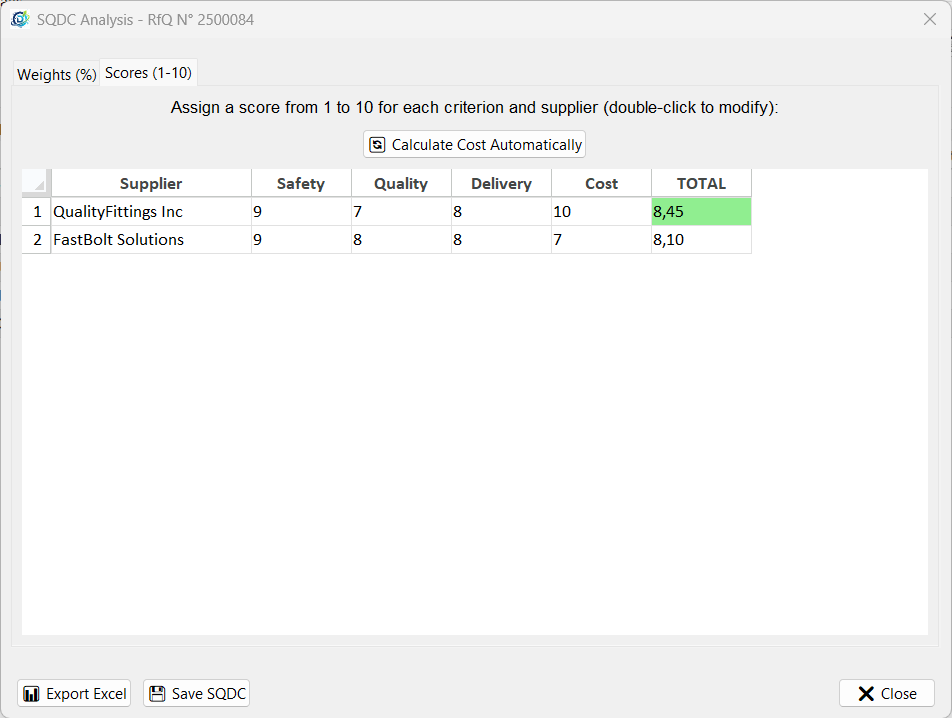
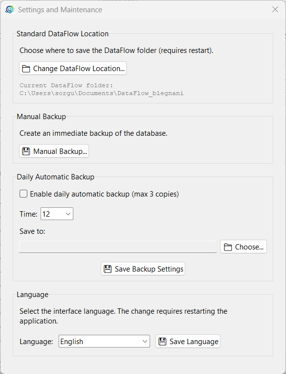
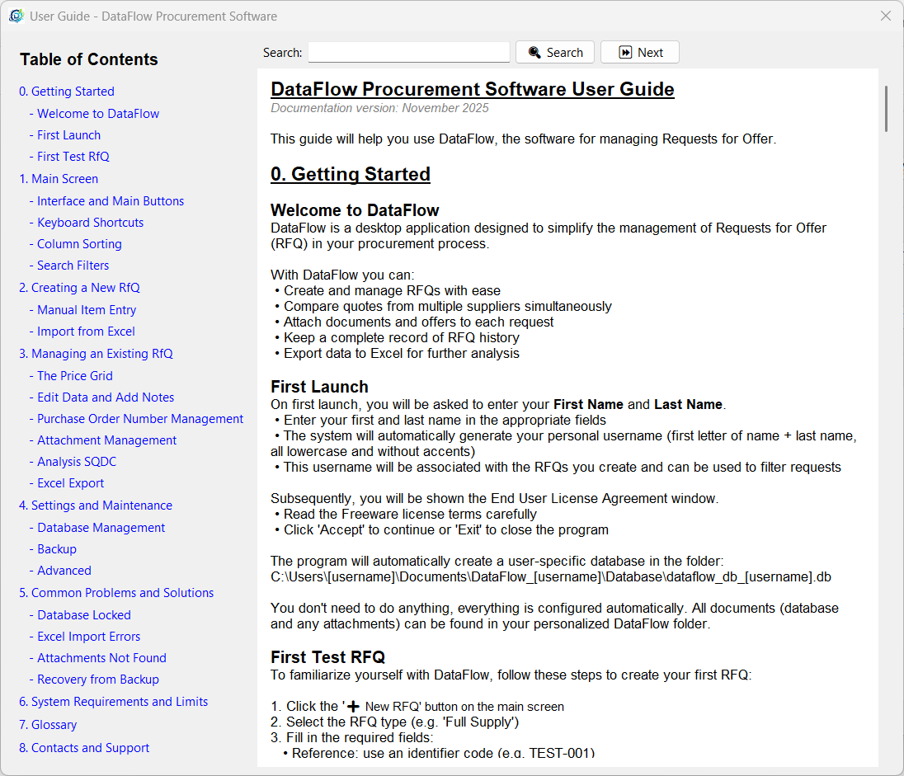

# DataFlow Procurement Software

📊 DataFlow is the essential desktop application designed to put an end to the dispersion of information typical of purchasing departments.

👨‍💼 Developed by a buyer for buyers, DataFlow offers a comprehensive platform to manage every stage of Requests for Quotation (RFQs) and analyse supplier quotes.

✨ What's new in version 2.0.0: Multi-user support with personal data folders, ability to view colleagues' databases, and improved stability with optimized data management.

🎯 The 'DataFlow' software is positioned as a niche tool and decision support tool that bridges the gap between basic management (Excel) and expensive ERP modules.

📧 If your workflow is currently fragmented across countless emails, scattered attachments and unconnected Excel spreadsheets, DataFlow brings order.

💪 The real strength of DataFlow lies in its ability to standardise processes.
Every new request, whether for a standard supply or contract manufacturing, follows a defined path.

🔄 Suggested typical workflow:

1️⃣ Enter a Request for Quotation (RFQ) and any internal documents (emails, drawings, etc.).  
2️⃣ Export the RFQ to Excel.  
3️⃣ Copy and paste the columns of the spreadsheet containing only the information needed by suppliers into an email and send your RFQ.  
4️⃣ Receive the quotations and enter them in the RFQ Control Panel.  
5️⃣ Attach the quotations received to the file.  
6️⃣ If necessary, perform the SQDC (Safety, Quality, Delivery, Cost) analysis to determine the winning Supplier.  
7️⃣ Save the SQDC analysis in the RFQ for future reference.  

📌 Single Point of Reference: Each RFQ is a complete record that includes the negotiation history, requested items, technical references (drawings, codes) and deadlines.

⚖️ Objective Comparison: You will no longer have to manually extract data from quotation PDFs.
Enter prices item by item to obtain an immediate and transparent comparison between offers from different suppliers.

📁 Integrated Archive: Quotation documents, internal communications, drawings and technical specifications are no longer attachments 'lost' in an inbox, but are archived in a logical manner and can be consulted directly from the Request for Quotation tab.

👥 Team Collaboration (NEW): Each user has their own personal data area, with the ability to view colleagues' RFQs in read-only mode. Ideal for purchasing departments with multiple buyers and for supervisors who need visibility into ongoing negotiations.

🎯 DataFlow puts you back in control. It ensures that purchasing decisions are always based on complete, transparent and easily accessible data, allowing you to focus on strategic negotiation rather than hunting for information.

🔒 Transform RFQ management from a fragmented task into a streamlined, centralised and secure process, with data stored locally and under your full control.

---

Originally developed for Windows (https://apps.microsoft.com/detail/9NT3BBG1W0K7) and also published on the Microsoft Store, the project is now being released as an open-source Linux edition under the **GNU GPLv3** license.  

The application is written in **Python** with a **Tkinter** GUI and uses **SQLite** as its local database engine.  
The current Linux port already includes cross-platform path handling, Linux window icon support, multilingual support (Italian and English), Excel import/export, attachment management, purchaseer the **GNU GPL order tracking, notes, and SQDC analysis support.  
The codebase also includes a dedicated database manager with SQLite/WAL support and logic for aggregating data across multiple user databases.

---

## Highlights

- Desktop application for procurement and RfQ management
- Python + Tkinter graphical interface
- SQLite database backend
- Excel import/export with `openpyxl`
- Attachment handling
- Purchase order (PO) tracking
- Notes management
- SQDC analysis export/save workflow
- English and Italian language support via gettext/polib
- Linux-compatible port with fixes for platform-specific behavior
- Existing Windows distribution on Microsoft Store

---

## Screenshots









---

## Project status

The Linux version is currently the open-source edition of the project.

Recent work on the port includes:

- removal/fix of Windows-specific paths
- Linux-compatible window icon handling
- Tkinter fix related to `grab_set()` placement after `wait_visibility()`
- update of licensing from Freeware to GNU GPLv3 for the Linux release
- multilingual updates in both the application and documentation
- footer/documentation cleanup aligned with the new license

---

## Tech stack

- **Language:** Python
- **GUI:** Tkinter
- **Database:** SQLite
- **Main file:** `DataFlow 2.0.0.py`

### Main dependencies

- `openpyxl`
- `Pillow`
- `polib`
- `tkcalendar`
- `tksheet`

---

## Installation

### Linux Installation

Download the Debian package from the **Releases** section.

Install with:

```bash
sudo apt install ./dataflow_2.0.0_amd64.deb
```

## Installing from Source

### 1. Clone the repository

```bash
git clone https://github.com/sorguido/dataflow-procurement-software.git
cd dataflow-procurement-software
```

### 2. Create a virtual environment

```bash
python3 -m venv .venv
source .venv/bin/activate
```

### 3. Install dependencies

```bash
pip install -r requirements.txt
```

### 4. Run the application

```bash
python3 "DataFlow 2.0.0.py"
```

---

## requirements.txt example

```txt
openpyxl
Pillow
polib
tkcalendar
tksheet
```

You can pin versions later after testing the Linux release more broadly.

---

## License

This project is released under the **GNU General Public License v3.0**.

The complete license text must be included in the repository in the `LICENSE` file.

---

## Windows version note

A Windows version of DataFlow also exists and has been published on the Microsoft Store  
```https://apps.microsoft.com/detail/9nt3bbg1w0k7?hl=it-IT&gl=IT)```

The Linux edition is the open-source GNU GPLv3 release. If future Windows releases are aligned with the same licensing model, they may also be distributed through this repository or a related packaging workflow.

---

## Contributing

DataFlow is now available as an open-source project.

The Linux version of the application has been released under the GNU GPLv3 license and the source code is available on GitHub.

Developers interested in improving or adapting the software, including future Windows versions, are welcome to contribute.

---

## Repository link

Once the GitHub repository is created, replace the placeholders in this README with the final public URL:

```text
https://github.com/sorguido/dataflow-procurement-software
```

