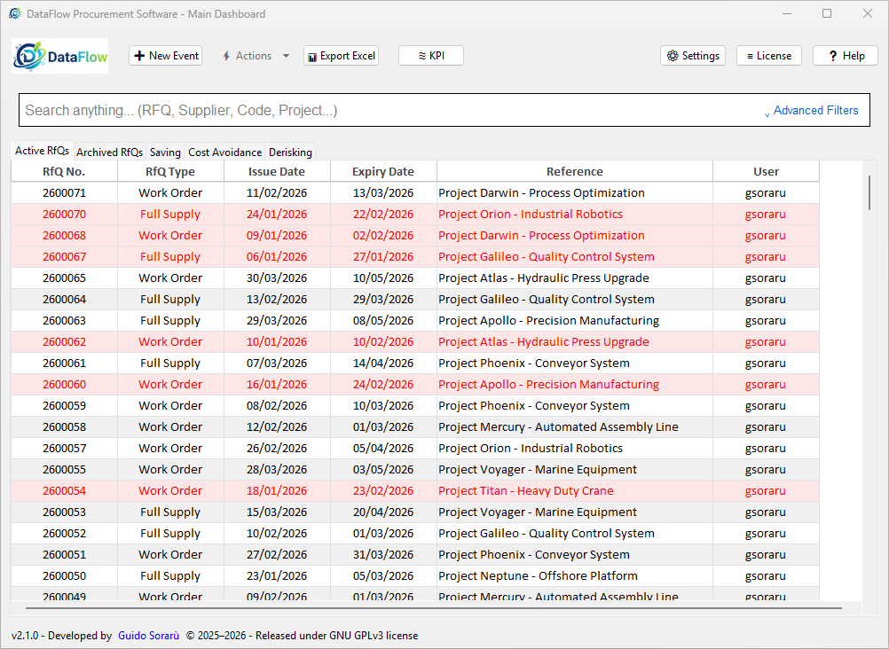
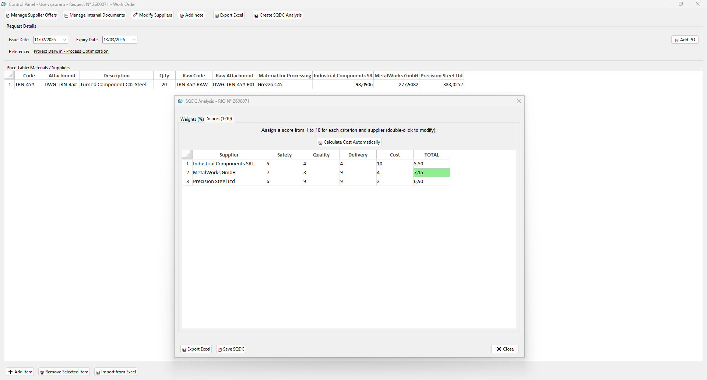
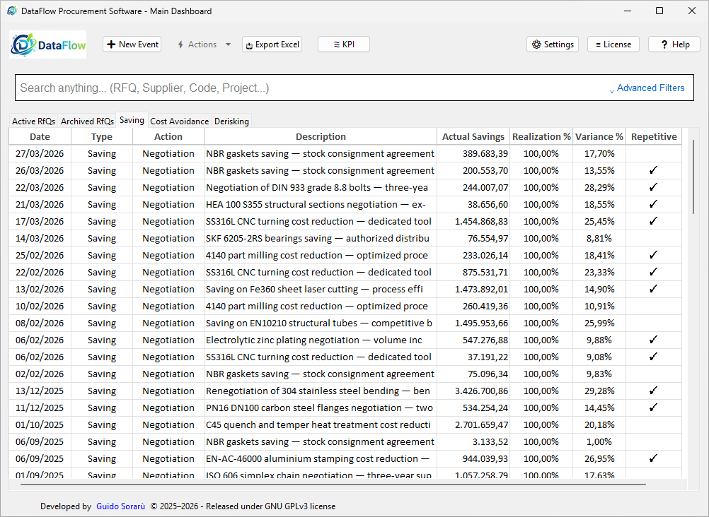
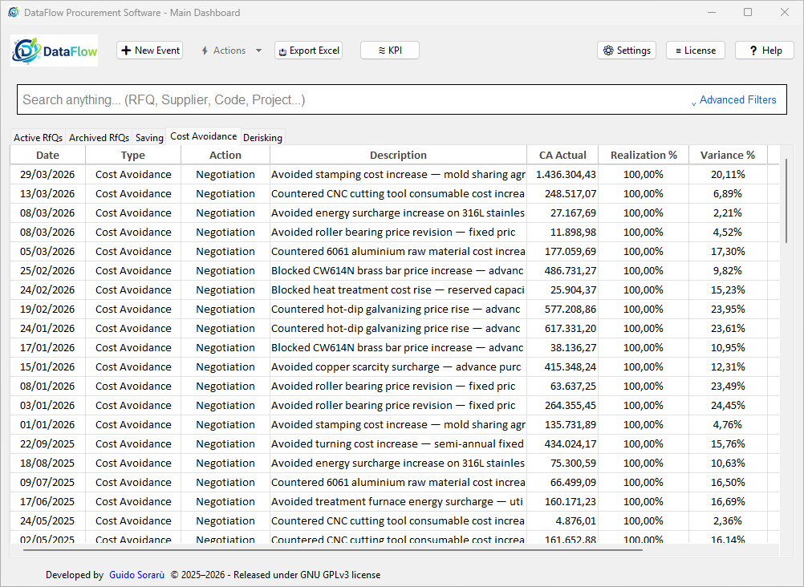
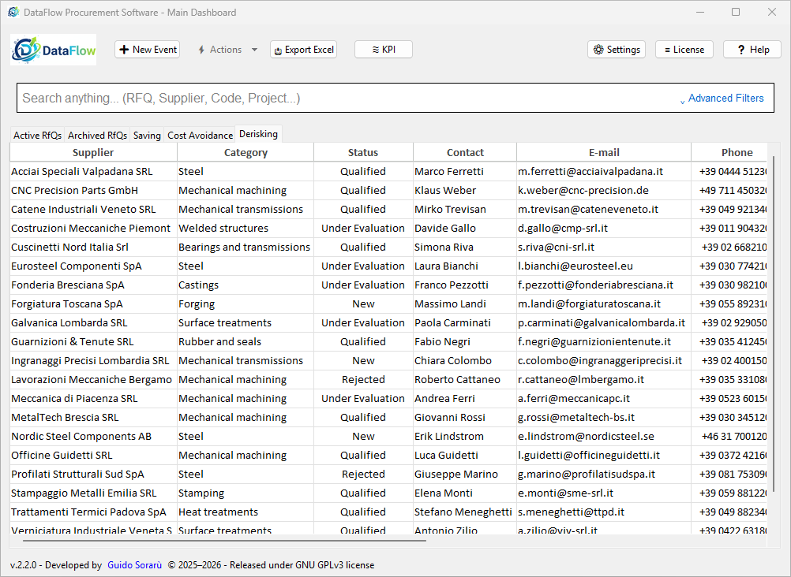
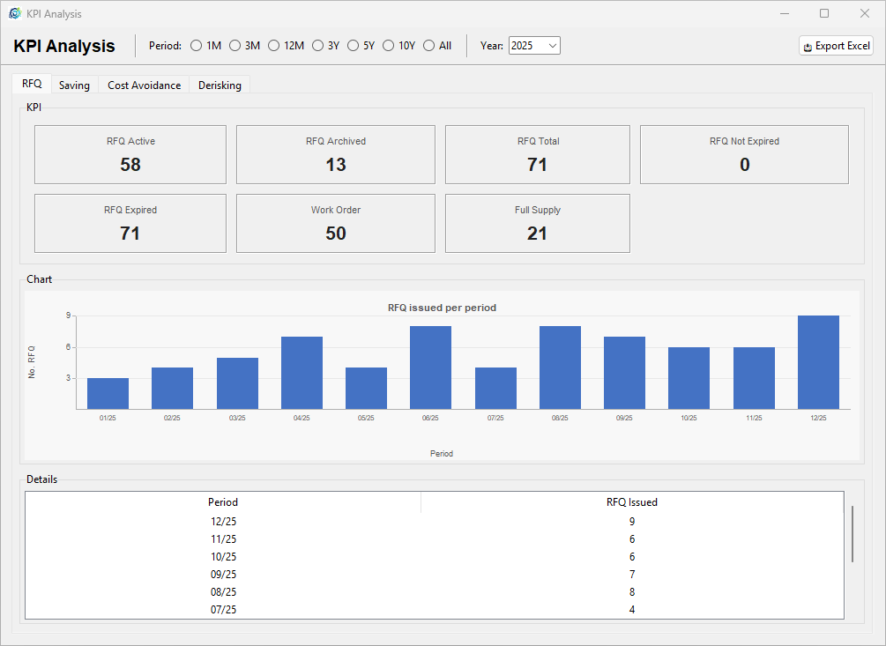
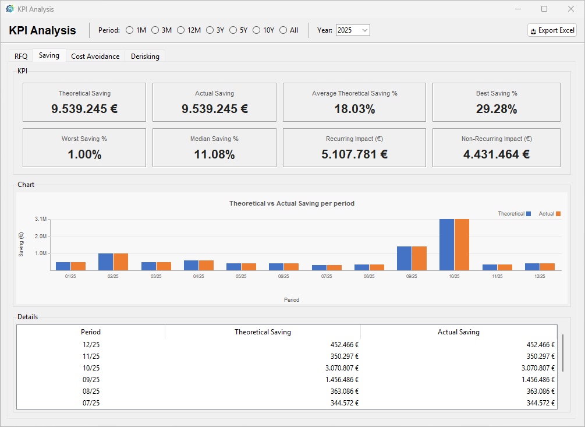

# DataFlow Procurement Software

📊 DataFlow is the essential desktop application designed to put an end to the dispersion of information typical of purchasing departments.

👨‍💼 Developed by a buyer for buyers, DataFlow offers a comprehensive platform to manage every stage of Requests for Quotation (RFQs), analyse supplier quotes, and measure procurement performance through dedicated KPI tracking.

✨ What's new in version 2.3.0: first-run interface language selection, faster standard-layout multi-user aggregation, corrected Italian VSM export wording, and refreshed application/package version metadata.

🎯 The 'DataFlow' software is positioned as a niche tool and decision support tool that bridges the gap between basic management (Excel) and expensive ERP modules.

📧 If your workflow is currently fragmented across countless emails, scattered attachments and unconnected Excel spreadsheets, DataFlow brings order.

💪 The real strength of DataFlow lies in its ability to standardise processes.
Every new request, whether for a standard supply or contract manufacturing, follows a defined path.

🔄 Suggested typical workflow:

1️⃣ Enter a Request for Quotation (RFQ) and any internal documents (emails, drawings, etc.).  
2️⃣ Export the RFQ to Excel.  
3️⃣ Copy and paste the columns of the spreadsheet containing only the information needed by suppliers into an email and send your RFQ.  
4️⃣ Receive the quotations and enter them in the RFQ Control Panel.  
5️⃣ Attach the quotations received to the file.  
6️⃣ If necessary, perform the SQDC (Safety, Quality, Delivery, Cost) analysis to determine the winning Supplier.  
7️⃣ Save the SQDC analysis in the RFQ for future reference.  
8️⃣ Log negotiation results as VSM events (Saving / Cost Avoidance / Derisking) to build your procurement KPI history.

📌 Single Point of Reference: Each RFQ is a complete record that includes the negotiation history, requested items, technical references (drawings, codes) and deadlines.

⚖️ Objective Comparison: You will no longer have to manually extract data from quotation PDFs.
Enter prices item by item to obtain an immediate and transparent comparison between offers from different suppliers.

📁 Integrated Archive: Quotation documents, internal communications, drawings and technical specifications are no longer attachments 'lost' in an inbox, but are archived in a logical manner and can be consulted directly from the Request for Quotation tab.

👥 Team Collaboration: Each user has their own personal data area, with the ability to view colleagues' RFQs in read-only mode. Ideal for purchasing departments with multiple buyers and for supervisors who need visibility into ongoing negotiations.

📈 Procurement KPIs: Track the measurable impact of your negotiation activity over time. The KPI Analysis window provides aggregated metrics on RFQ activity, Savings, Cost Avoidances, and Derisking, with interactive charts and Excel export.

🎯 DataFlow puts you back in control. It ensures that purchasing decisions are always based on complete, transparent and easily accessible data, allowing you to focus on strategic negotiation rather than hunting for information.

🔒 Transform RFQ management from a fragmented task into a streamlined, centralised and secure process, with data stored locally and under your full control.

---

Originally developed for Windows and also published on the [Microsoft Store](https://apps.microsoft.com/detail/9nt3bbg1w0k7?hl=en-EN&gl=EN), the project is now released as an open-source Linux edition under the **GNU GPLv3** license.

The application is written in **Python** with a **Tkinter** GUI and uses **SQLite** as its local database engine.  
The current Linux port includes cross-platform path handling, Linux window icon support, multilingual support (Italian and English), Excel/PDF export, attachment management, purchase order tracking, notes, SQDC analysis support, VSM event tracking, KPI analysis, and a potential supplier registry.  
The codebase includes a dedicated database manager with SQLite/WAL support and logic for aggregating data across multiple user databases.

---

## Highlights

- Desktop application for procurement and RFQ management
- Python + Tkinter graphical interface
- SQLite database backend
- Excel import/export
- Attachment handling
- Purchase order (PO) tracking
- Notes management
- SQDC analysis export/save workflow
- **VSM module**: track Saving, Cost Avoidance, and Derisking events
- **KPI Analysis window**: aggregated metrics with charts and Excel export
- **Potential Supplier registry**: manage and qualify new suppliers (Derisking workflow)
- **RFQ PDF export**: export Requests for Quotation with persistent logo and editable language template
- **Global search bar**: multi-field search with contextual filters across all main dashboard tabs
- English and Italian language support
- Linux-compatible port with fixes for platform-specific behaviour
- Existing Windows distribution on Microsoft Store

---

## Functional Areas

### RFQ Management
Create, manage, and archive Requests for Quotation. Record supplier quotes item by item, attach documents, track purchase orders, and run SQDC analyses to support supplier selection decisions.

### Value Stream Mapping (VSM)
Track negotiation outcomes as structured events directly from the main dashboard:

- **Saving**: price reduction achieved through negotiation, with optional payment terms driver
- **Cost Avoidance**: prevented cost increase, with configurable realizzo percentage
- **Derisking**: supply chain risk reduction activity, with new supplier introduction tracking

Each event generates monthly economic impact projections. OPEX-repetitive events propagate their effect over up to 24 months.

### KPI Analysis
A dedicated window provides aggregated procurement KPIs across four dimensions:

- **RFQ KPIs**: volume, active/archived breakdown, supplier and product code coverage
- **Saving KPIs**: theoretical vs. actual saving amounts with trend charts
- **Cost Avoidance KPIs**: avoided costs over time
- **Derisking KPIs**: new suppliers introduced, qualification status distribution

Filters by period preset, year, or custom date range. Export to Excel available.

### Potential Supplier Registry
Manage the lifecycle of potential new suppliers directly within the Derisking tab:

- Record supplier name, category, contact details, and qualification status
- Statuses: New, Under Evaluation, Qualified, Rejected
- Supplier name suggestions and reusable category management
- Integrated with the Derisking VSM workflow

---

## Screenshots















---

## Project Status

Version 2.3.0 is a conservative maintenance release focused on first-run language handling, multi-user aggregation performance, Italian VSM wording, and packaging/version alignment.

---

## Tech Stack

- **Language:** Python
- **GUI:** Tkinter
- **Database:** SQLite (WAL mode)
- **Main file:** `dataflow.py`

### Main Dependencies

- `openpyxl`
- `Pillow`
- `polib`
- `reportlab`
- `tkcalendar`
- `tksheet`
- `tkinterdnd2`

---

## Installation

# [📥 DOWNLOAD 📥](https://github.com/sorguido/dataflow-procurement-software/releases)

### Linux Installation

➡ Download AppImage package and double click it (for all Linux distributions)

After downloading the package, give execution permissions:

```bash
chmod +x DataFlow_2.3.0_Linux_x86_64.AppImage
```

### Windows Installation

➡ [Download](https://apps.microsoft.com/detail/9nt3bbg1w0k7?hl=en-EN&gl=EN) Msix package from Microsoft Store

### Installing from Source

### 1. Clone the repository

```bash
git clone https://github.com/sorguido/dataflow-procurement-software.git
cd dataflow-procurement-software
```

### 2. Create a virtual environment

```bash
python3 -m venv .venv
source .venv/bin/activate
```

### 3. Install dependencies

```bash
pip install -r requirements.txt
```

### 4. Run the application

```bash
python3 dataflow.py
```

---

## Requirements

```txt
openpyxl
Pillow
polib
reportlab
tkcalendar
tksheet
tkinterdnd2
```

---

## License

This project is released under the **GNU General Public License v3.0**.

The complete license text is included in the repository in the `LICENSE` file.

---

## Windows Version Note

A Windows version of DataFlow also exists and has been published on the Microsoft Store:  
https://apps.microsoft.com/detail/9nt3bbg1w0k7?hl=en-EN&gl=EN

The edition is open-source GNU GPLv3 release. If future Windows/Linux releases are aligned with the same licensing model, they may also be distributed through this repository or a related packaging workflow.

---

## Contributing

DataFlow is an open-source project developed with a strong focus on stability, clarity and real-world usability in procurement workflows.

Contributions are not only welcome — they are essential for the sustainable evolution of the project.

However, this project follows a set of guiding principles (“dogma”) to preserve its reliability and usability:

- Prefer **small, surgical, and reversible changes**
- Avoid **global refactors** unless strictly necessary
- Do not introduce **new dependencies** without strong justification
- Prioritize **stability over innovation**
- Maintain **UI consistency and predictable behavior**
- Every change must aim to **avoid regressions**

### Where to start

If you want to contribute, the best entry points are:

- Bug fixes (especially UI, translations, and Excel export)
- Small usability improvements
- Minor performance or stability fixes

### Areas requiring caution

The following areas are considered high-impact and should not be modified without prior discussion:

- `dataflow.py` core logic
- Database schema and persistence layer
- Main dashboard behavior and navigation flow
- Packaging and build system

### Approach

This project is maintained with a **quality-first mindset**.  
Contributions must align with the principles above.

If in doubt, open an issue before starting work.

---

📘 For a deeper understanding of the architecture and internal logic, refer to the technical manual:  
[Technical Manual](docs/DATAFLOW_2.1.0_TECHNICAL_MANUAL.md)

---
